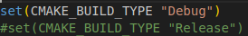
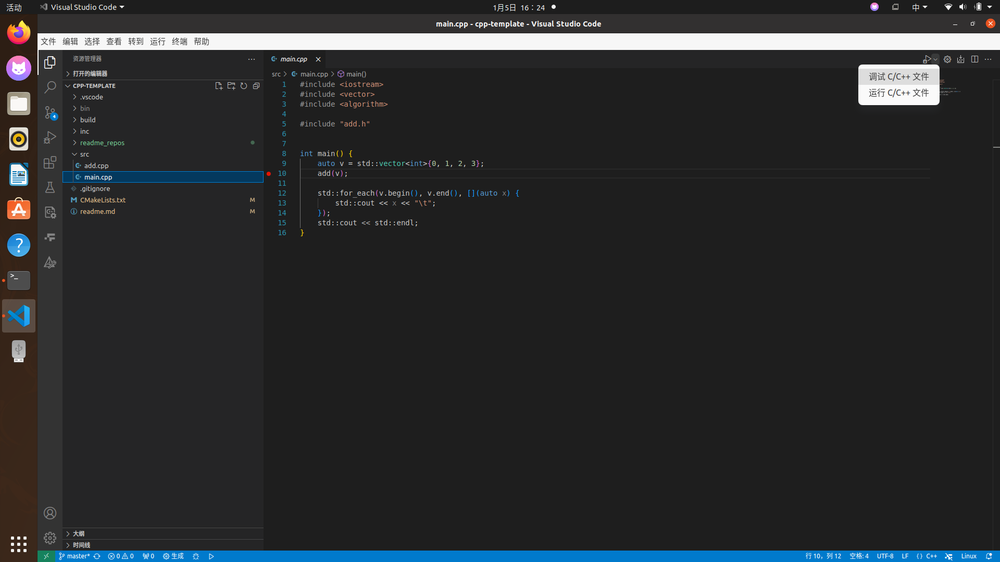
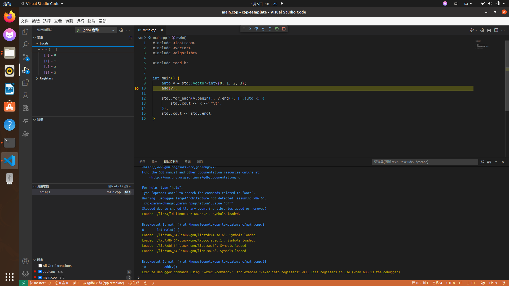

# Ubuntu系统VSCode环境下的C++模板  
## 可用于vscode对c++的debug调试  
### 项目结构
模板的源码部分由src和inc构成，src包含*.cpp，*.c的源文件，inc包含*.h或*.hpp的头文件。  
build文件夹存放cmake生成的中间文件，最后编译完成的可执行文件放在bin文件夹里。
### 依赖
* cmake, make, gdb, gcc
```shell
sudo apt update
sudo apt install build-essential gdb
sudo apt install cmake
```
* vscode需要插件:C/C++, C/C++ Extension Pack
### 模板CMake编译
```shell
# 从git克隆这个模板
git clone https://github.com/Leopold80/cpp-template
# 跳进build文件夹
cd cpp-template
cd build
# 运行cmake
cmake ..
# 运行make
make
# 跳进bin文件夹
cd ../bin
# 运行程序
./cpp-template
```
注：以debug形式或者release形式编译程序应在CMakeLists.txt文件中分别注释掉如下图的两行代码：  



### 模板使用VSCode进行Debug调试
调试之前请先以Debug形式编译好可执行文件。  
随后使用vscode打开文件夹，切换到main函数所在的文件，选择调试c/c++文件：  

  

随后选择gdb(因为之前我们已经编译好了可执行文件以供调试，所以直接选择gdb即可)  

  

大功告成！